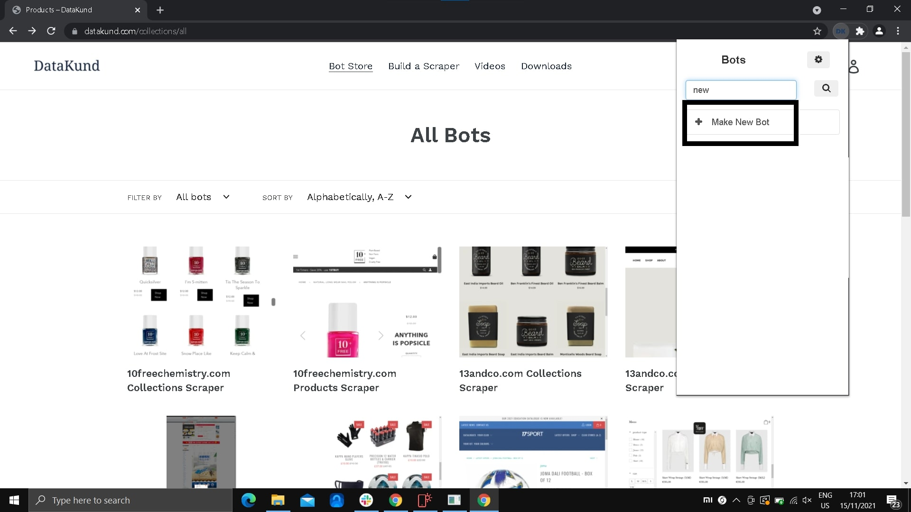

How to install DataKund
************

* **Step1:** Go to chrome and open https://datakund.com/ (Datakund website).

   * A chrome page like shown in image below will open.
   

* **Step2:** On the top of the page, there is downloads option along with bot store, build a scraper and videos.

   * click on "downloads", as shown in image below.

.. image:: 2.jpg
   
* **Step3:** After clicking on the "downloads", a page like in Image 3 appears.

    * In this page under downloads, there is Datakund studio, under which there is download for windows.
    
    * Click the link to download Datakund.
   

   
* **Step4:** Download will start immediately, and wait for it to download.

   * When the download is done, double click the Datakund.exe file as shown in Image 3 to install Datakund.
   

   
* **Step5:** A pop up window appears.

   * click "I accept the agreement".
   
   * next click "next" as shown in the Image below, to go to the next step in installing Datakund. 
   

* **Step6:** Next process includes weather to create a desktop shortcut.
 
  * check it and then click "next" at the bottom of the pop up window as shown in Image below.

* **Step7:** Now to finish the setup click "install", in the pop up window as shown in the Image 7 to install Datakund.  

* **Step8:** Wait for it to install.

   * check the launch Datakund to launch immediately
   
   * next click "next" as shown in the Image below, to go to the next step in installing Datakund. 
   
   * click "finish" to end the setup as shown in Image below. 
   

* **Step9:** Datakund will automatically launch and wait for chome window to open as shown in Image below.
   

* **Step10:** Click the extension button at the top right corner of the chrome window

   * pin the Datakund extention to the chrome toolbar  and click Datakund to run as seen in Image below.
   

* **Step11:** In the extension window, login window appears as shown in Image 11.

   * Login through google in the Datakund extension to make bot or to search for existing bot.
   

* **Step12:** Click on search to search for a bot or to create a new bot.  
   

