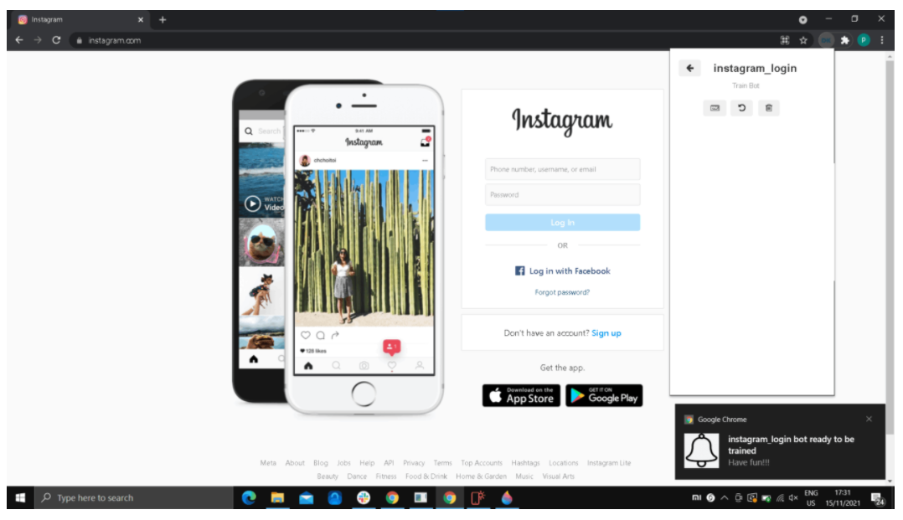
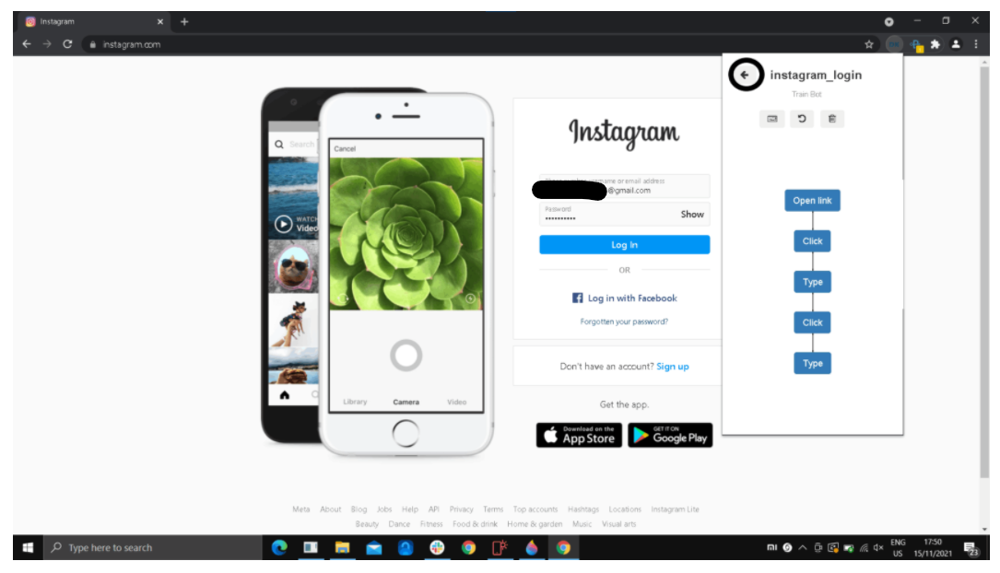

Create a bot that login's Instagram
************

* **Step1:** Run Datakund application or double click Datakund shortcut on the desktop, a Chrome windows will open as shown in Image 1..

   * (make sure to login in Datakund extension in order to create or search a bot). 
   
   * Pin the Datakund studios to the toolbar. On the chrome toolbar, click Datakund extension.
   

* **Step2:** Create a new bot naming "instagram_login".

   
* **Step3:** Click on the Datakund extension, to minimise the extension bar.

    * Lets go to https://www.google.com/ before training the bot.
   

   
* **Step4:** Click on Datakund extension again, and click "train" to start training our new bot (instagram_login).
   

   
* **Step5:** As soon as we click "train", bot starts training and mimics your action and adds it to the event. 
   

* **Step6:** Now refresh the page, to add URL(https://www.instagam.com/login) to the event.
 
  * Can also add the URL to event by typing "instagram login" in search bar in toolbar. 
  
  * Now minimises Datakund extension window.

* **Step7:** To see weather the URL is added to the event or not.

  * Click the Datakund extension and show able to see as shown in Image below.
  
  * Now click the Datakund extension to minimize and continue the training.

* **Step8:** Now entre email and password and press login to train the bot for the 1st time.

  * (no need to give accurate details)
   

* **Step9:** Now bot is trained, to end the training,

   *click on datakund extension and click back button as shown in the Image below. 
   

* **Step10:** Now to run the bot, click "run" button to run the bot as shown in Image below.
   

* **Step11:** After clicking "run", extension window as shown in Image below appears.

   * Now wait for the bot to load.
   

* **Step12:** After the Bot is done loading, enter your email id and password and run the bot.
   

* **Step13:** After running the bot, wait for the bot to do the job as shown in Image 13. It will automatically login with a single press. 
   

* **Step14:** As shown in the Image 14, bot will login Instagram automatically.
   

