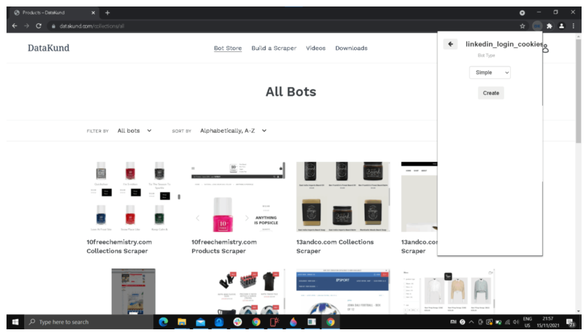
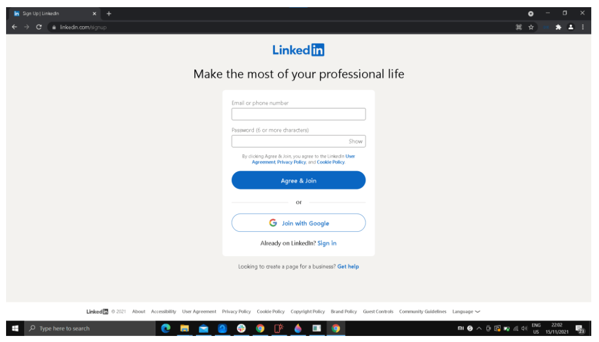
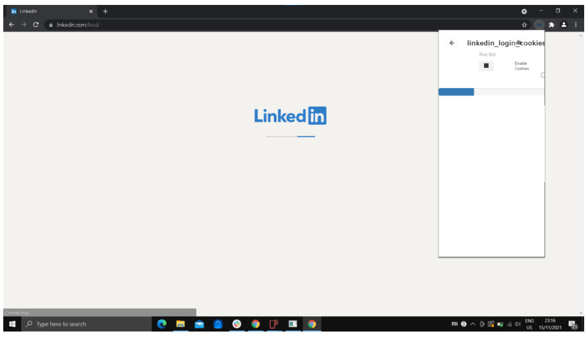
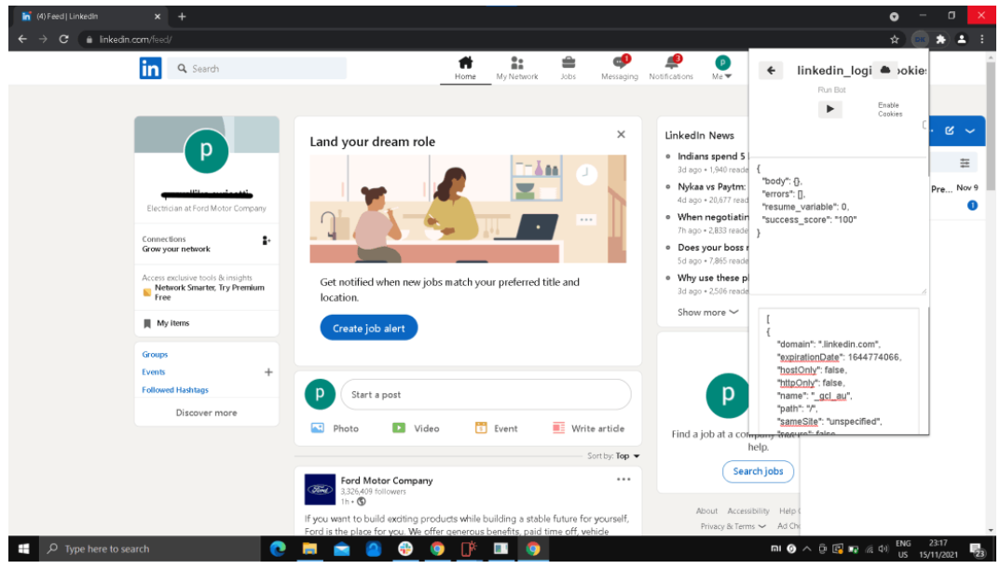

Create a bot that login's LinkedIn with cookies
************

* **Step1:** Run Datakund application or double click Datakund shortcut on the desktop, a Chrome windows will open as shown in Image 1..

   * (make sure to login in Datakund extension in order to create or search a bot). 
   
   * Pin the Datakund studios to the toolbar. On the chrome toolbar, click Datakund extension.
   

* **Step2:** Create a new bot naming "linkedin_login_cookies".

   
* **Step3:** Click on the Datakund extension, to minimise the extension bar.

    * Lets go to https://www.linkedin.com/signup (linkedin signup page), before training the bot.
   
.. image:: 73.png
   
* **Step4:** Since we are using cookies as input to login, before training the bot we need to add variable(cookies) to the input.

   * To add click on the variable button as shown in the Image 4.
   
.. image:: 74.png
   
* **Step5:** After clicking "variables", a extension window as shown in Image 5 appears. 

   * At the input column, type cookies and save. Now go back to train the bot.
   

* **Step6:** Click on Datakund extension again, and click "train" to start training our new bot (linkedin_login_cookies).

.. image:: 76.png

* **Step7:** As soon as we click "train", bot starts training and mimics your action and adds it to the event.

* **Step8:** Now refresh the page, to add URL to the event.

   * Can also add the URL to event by typing "linkedin.com" in search bar in toolbar.
   
   * Minimise Datakund extension windows.
   

* **Step9:** To see weather the URL is added to the event. 

   * Click the Datakund extension and show able to see as shown in Image 7. 
   
   * Now click the Datakund extension to minimize and continue the training.
   

* **Step10:** Now right click anywhere on the screen, to see datakund in the menu ba.

   * Click Datakund --> inputs --> variables --> cookies --> set cookies.
   
   * As shown in the Image 10. 
   
.. image:: 80.png

* **Step11:** After setting the cookie, again refresh the page. 

   * Now the events should be in order as shown in the Image 11.
   

* **Step12:** Now to run the bot click "run" button and paste the cookies in the cookie extension (open a fresh chrome browser open linkedin and login, after login in install cookie extension and copy the cookies of logged in linkedin page).
   
   * After pasting the cookies in the the extension bar looks as in the Image 12.
   
   * Now click "Run"
   
.. image:: 82.png

* **Step13:** After running the bot, wait for the bot to do the job as shown in Image 13. 

   * It will automatically login with a single press.
   

* **Step14:** As shown in the Image 14, bot will login Iinkedin automatically.

