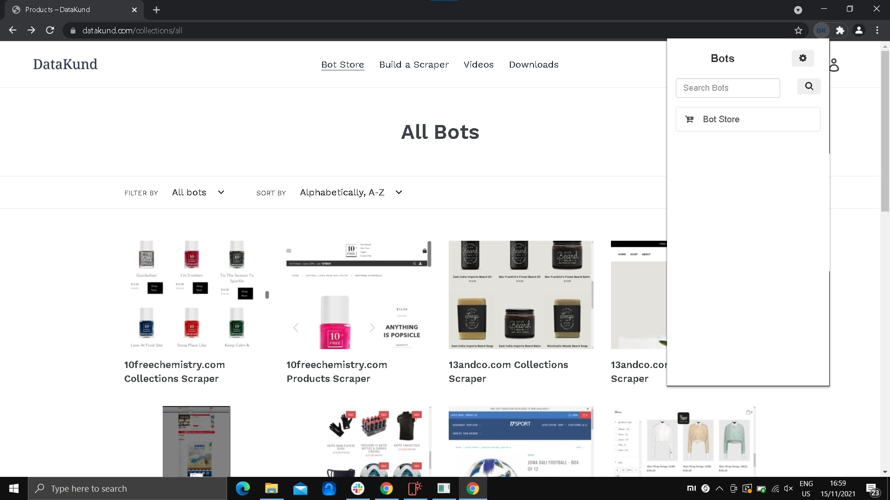

How to make a bot using datakund
************

* **Step1:** Run Datakund application or double click Datakund shortcut on the desktop.

   * A Chrome windows will open as shown in Image below.
   
   * (make sure to login in Datakund extension in order to create or search a bot). 

   * Pin the Datakund stuidos to the toolbar.
   
.. image:: 1.jpg

* **Step2:** On the chrome toolbar, click Datakund extension to create a new bot. A extension windows shows as shown in Image 2.

   *  A extension windows shows as shown in Image below.

   
* **Step3:** Type a new bot name in the "search bots" box which is shown in Image below.
   
.. image:: 3.jpg
   
* **Step4:** Click "Make New Bot" button, shown in Image below, to create a new bot.
   
.. image:: 4.jpg
   
* **Step5:** After clicking "create a new bot", a next window appear as shown in Image below.

   * Click which type of bot is to be created and click "create" to create a new bot.
   
.. image:: 5.jpg

* **Step6:** After clicking "create", new bot is created to train, run, etc..

.. image:: 6.jpg
