Create a bot that scrapes data in PYPI, integrating with google sheets
**********************************************************************************************************

* **Step1:** create a new bot naming "pypi_scrapper".
   
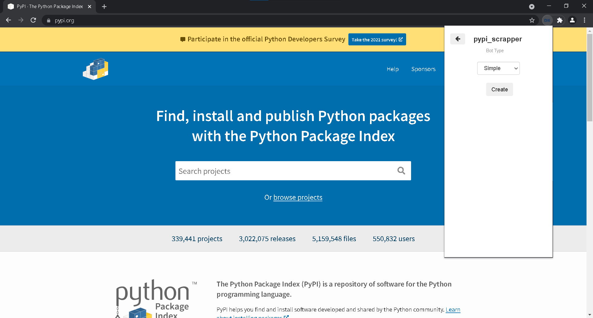

* **Step2:** Add output variables (title, date, link, description), before training the bot, as shown in picture below.

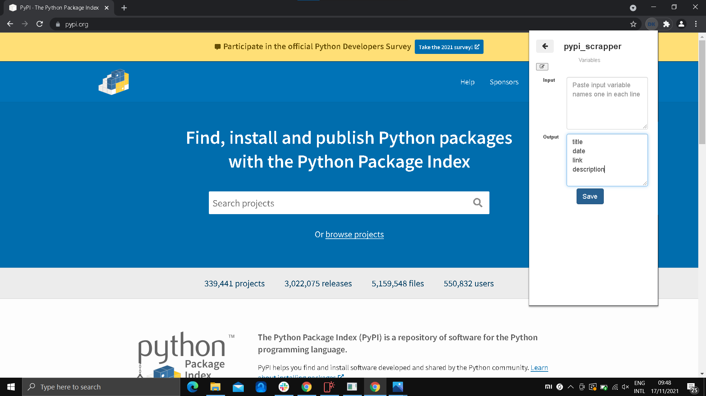

* **Step3:** Click on the Datakund extension, to minimise the extension bar.

    * Lets go to https://www.pypi.org (pypi page), before training the bot.
   
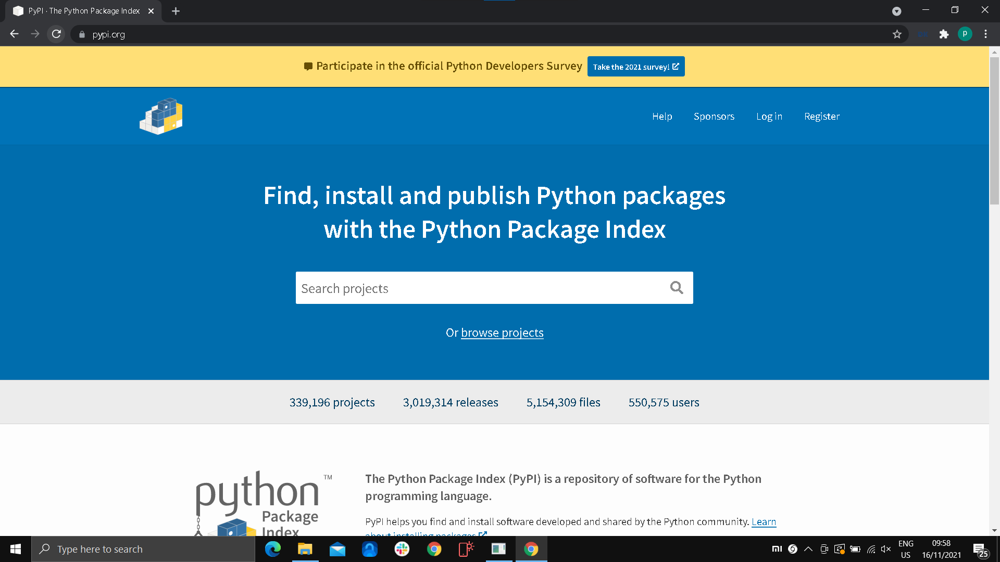
   
* **Step4:** start training the bot.

   * refresh the pypi page to add the URL to the event.

   * click on search and type a keyword and press entre to search
   
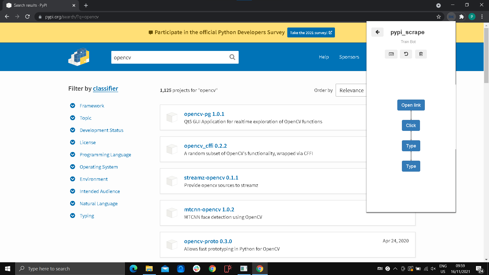

* **Step5:** Now Right click on empty space, a menu appears.

   * click DataKund--> more--> wait--> static--> 3.(this is to delay the bot's  next action for 3sec.)

   * see below picture for refence
   
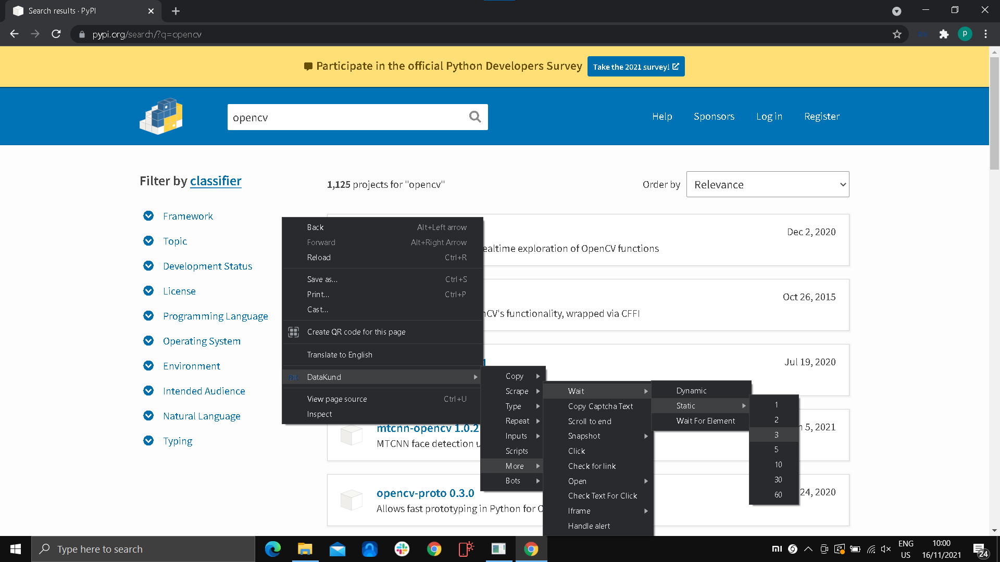

* **Step6:** Again right click on the empty space, a menu appear.

   * click DataKund--> repeat--> element repeat--> begin repeat.(this is for the bot to repeat the following steps repeatedly.)

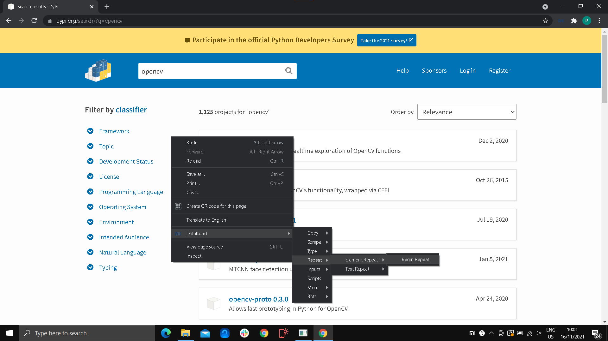

* **Step7:** now we need to scrape(project link, project name or title, date, description) data from the pypi website.

   * To scrape, we must first train the bot my scraping for a single project.
   
   * To scrape the project link, right click on the project name to see the option.
   
   * Then click DataKund--> scrape--> link--> link.(the link will store in the variable link)

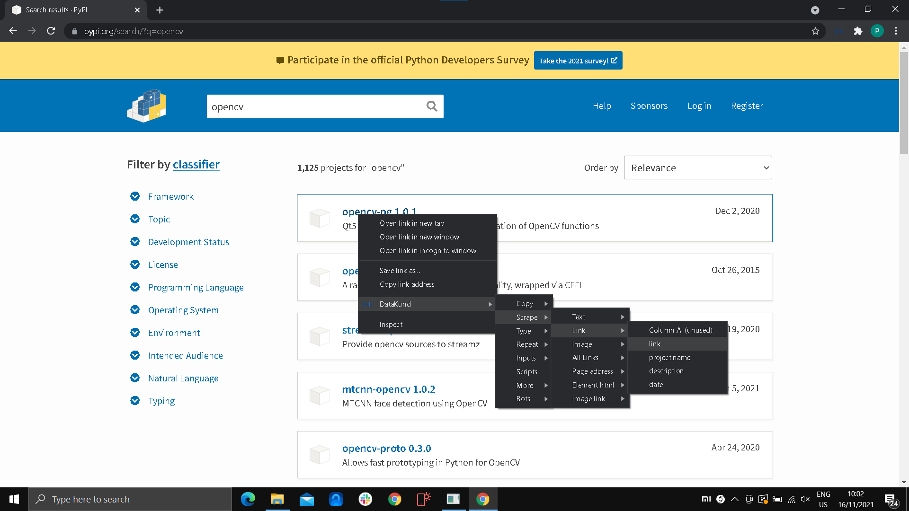

* **Step8:** To scrape the project name, right click on the project name to see the option.
   
   * Then click DataKund--> scrape--> text--> project name or title.(the link will store in the variable project name)

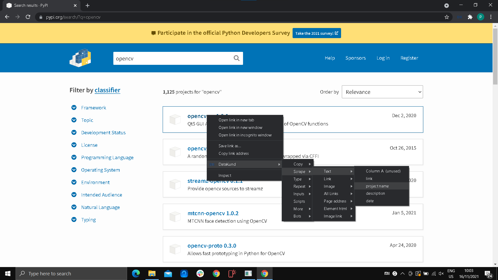

* **Step9:** To scrape the description, right click on the description, under the project name to see the option.
   
   * Then click DataKund--> scrape--> text--> description.(the link will store in the variable description)

* **Step10:** To scrape the project name, right click on the project name to see the option.
   
   * Then click DataKund--> scrape--> text--> project name or title.(the link will store in the variable project name)

* **Step11:** After doing the date scrape, which is stored in the Date variable, now we can go back and stop the training.
   
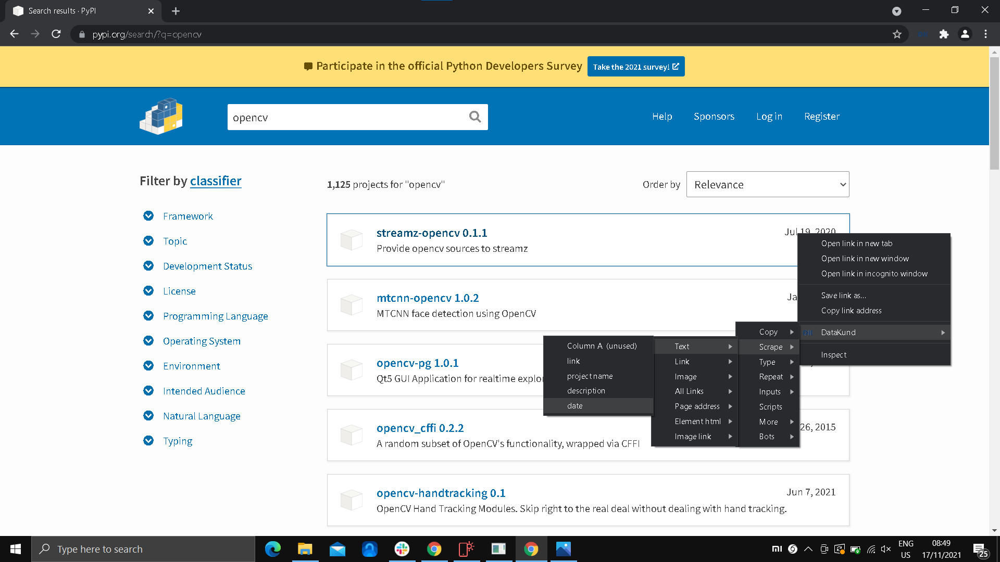

* **Step12:** Now to run the bot click "run" button
   
   * Now click "Run"
   
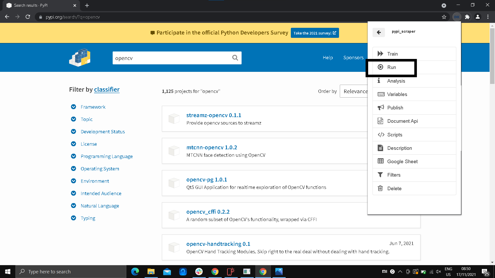

* **Step13:** After running the bot, wait for the bot to do the job as shown in Image below. 

   * It will automatically search keyword.
   

* **Step14:** as shown in picture below, our bot scraped the the data for the keyword in the pypi website

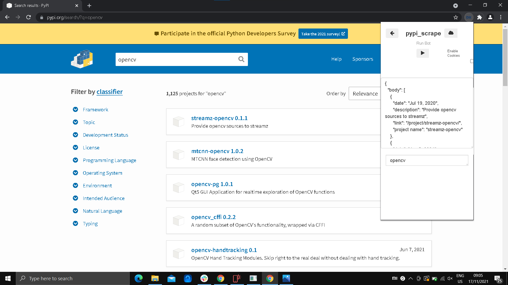

* **Step15:** Now open google sheets and entre the details in row and column as shown below.

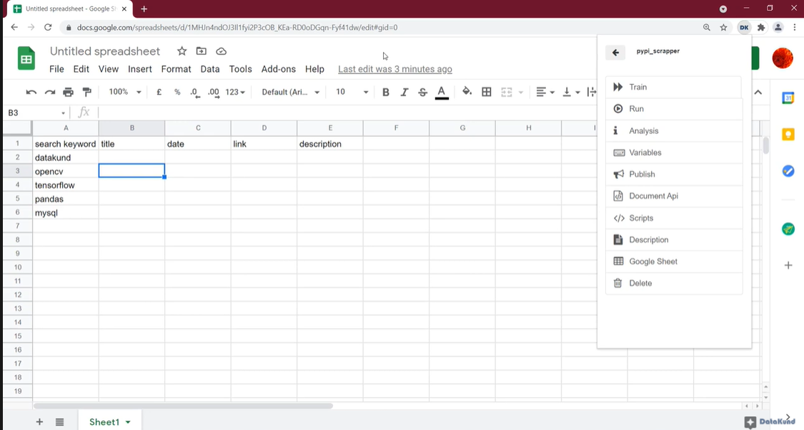

* **Step16:** Now copy google sheets URL.

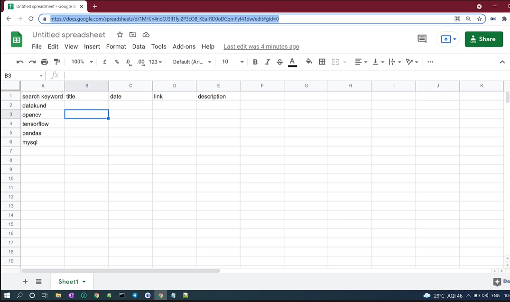

* **Step17:** Go to DataKund extension, click "google sheets" in the bot's menu.

  * Now paste the google sheet URL in the "sheet link" box and click "link" button.

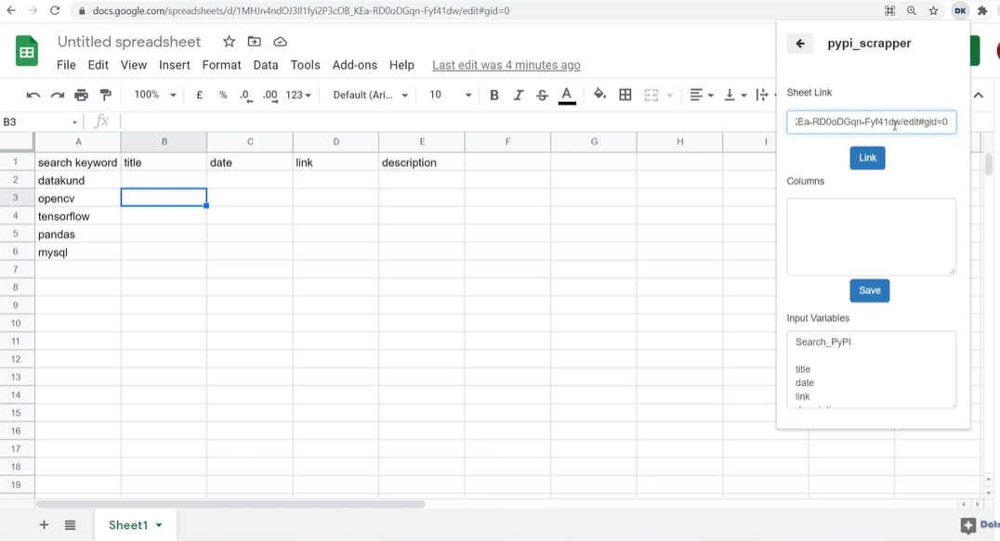

* **Step18:** After linking, the columns box will automatically map with variables.

   * Now click "save". 

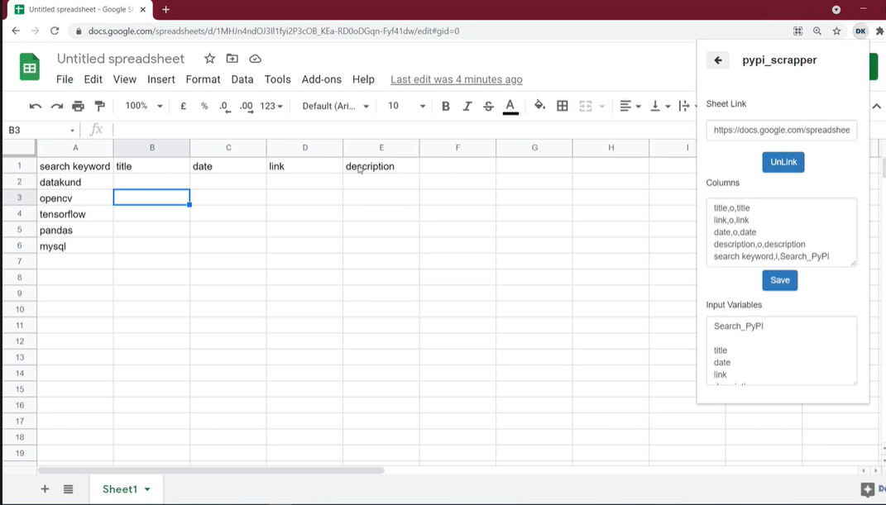

* **Step19:** Go back to menu and click "Run", and wait for the bot to load.

  * After the bot is done loading, click the run button.

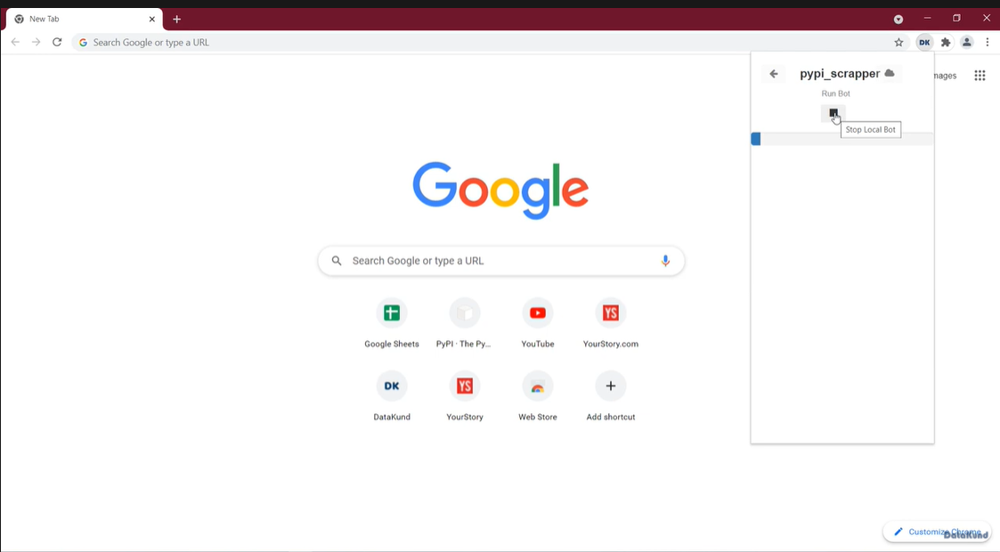

* **Step20:** After the bot is done scraping(which you can see while runing the bot.)

  * go to google sheets URL to see that our Bot scraped the Data and updated the google sheets.

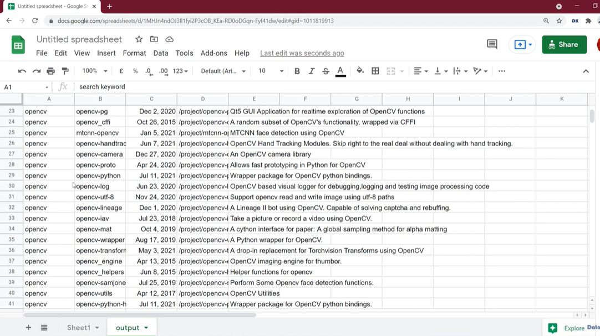
