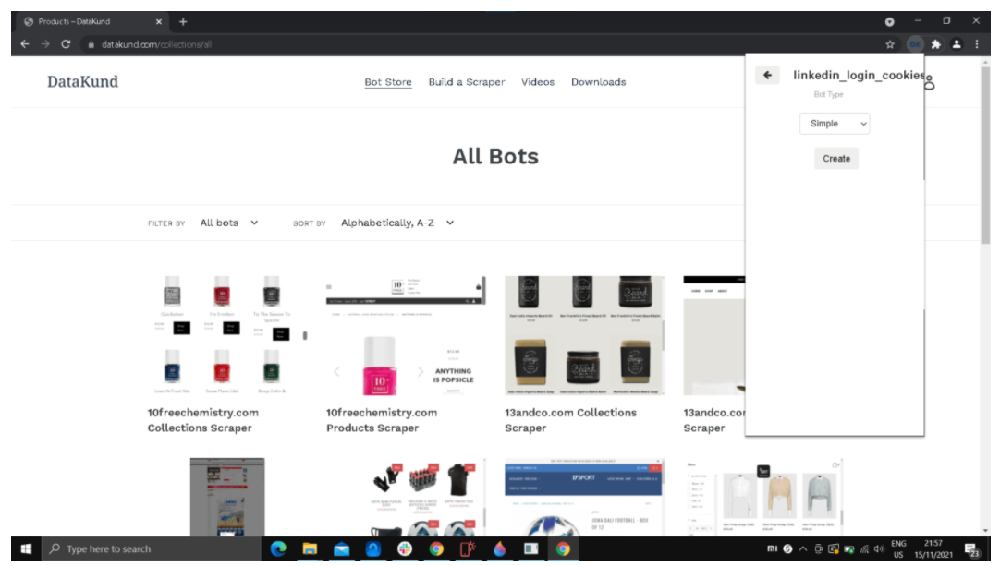
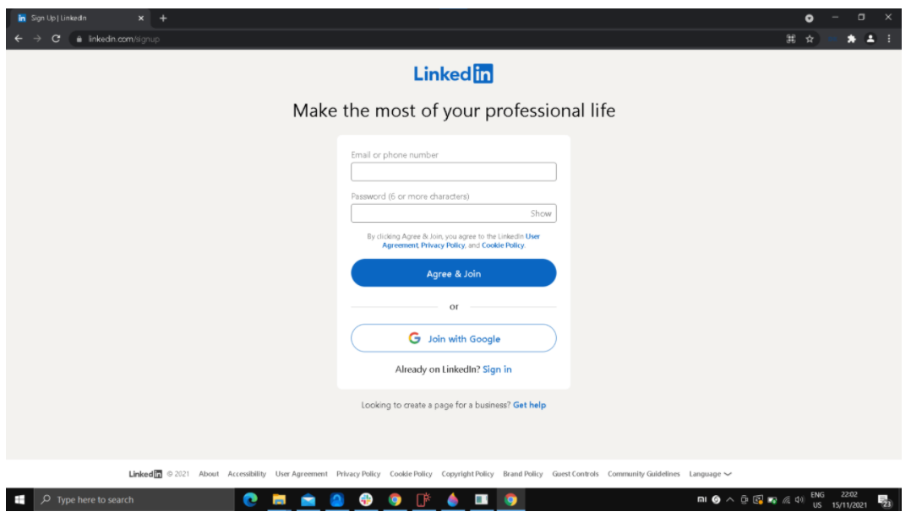
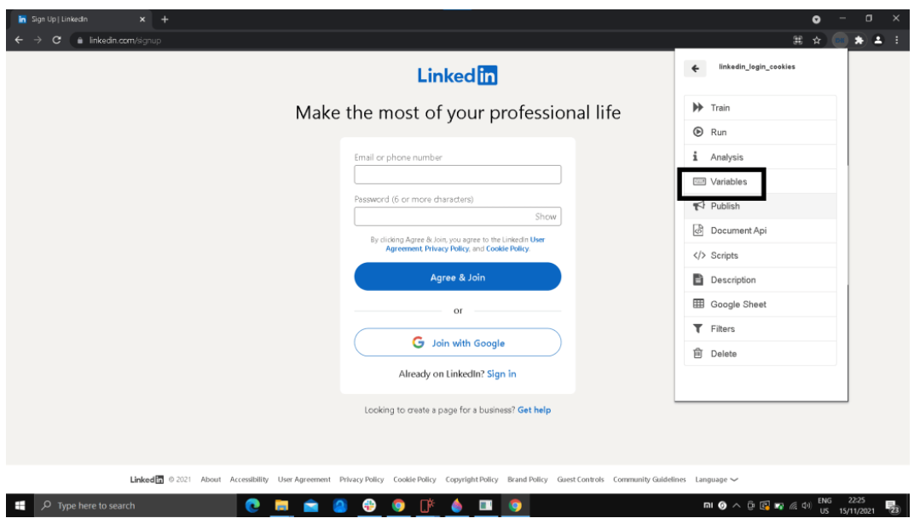
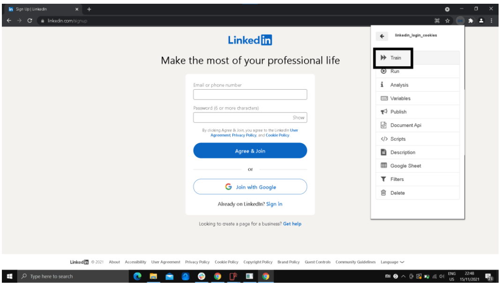
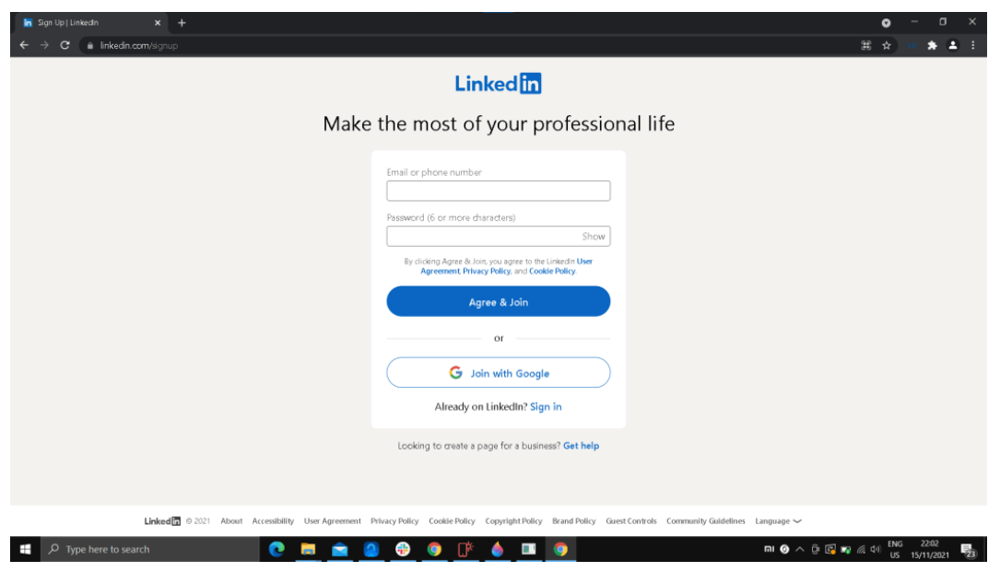
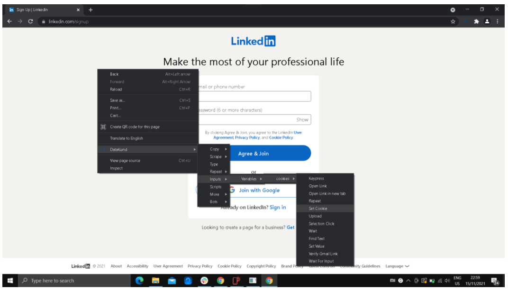
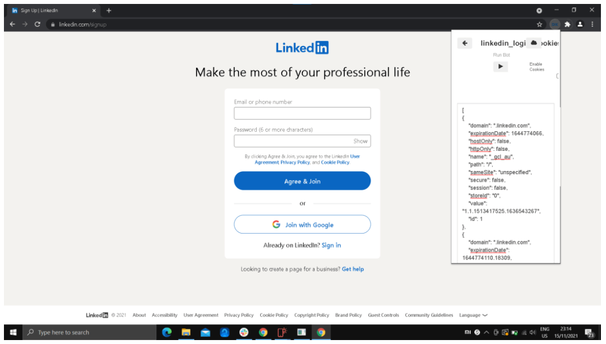
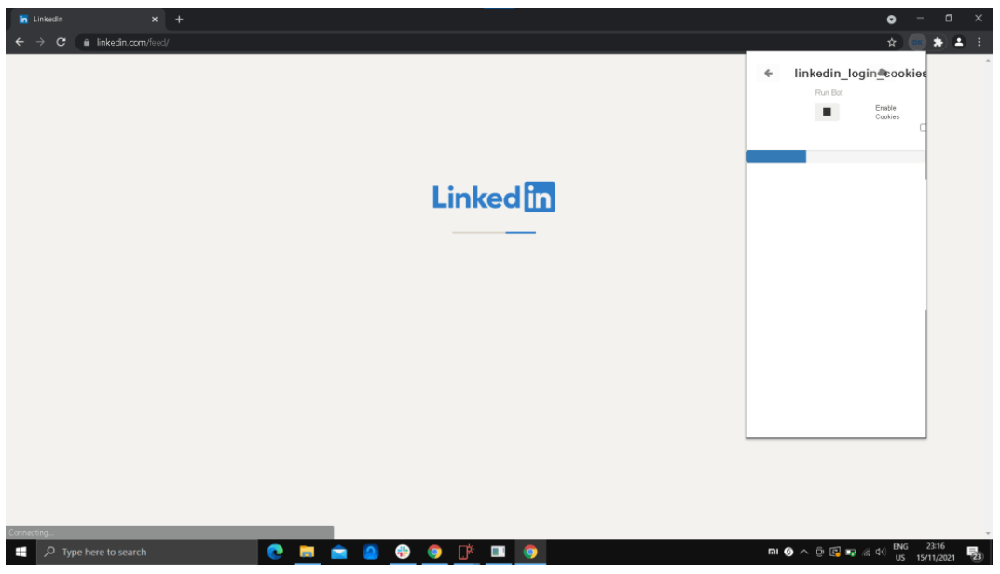
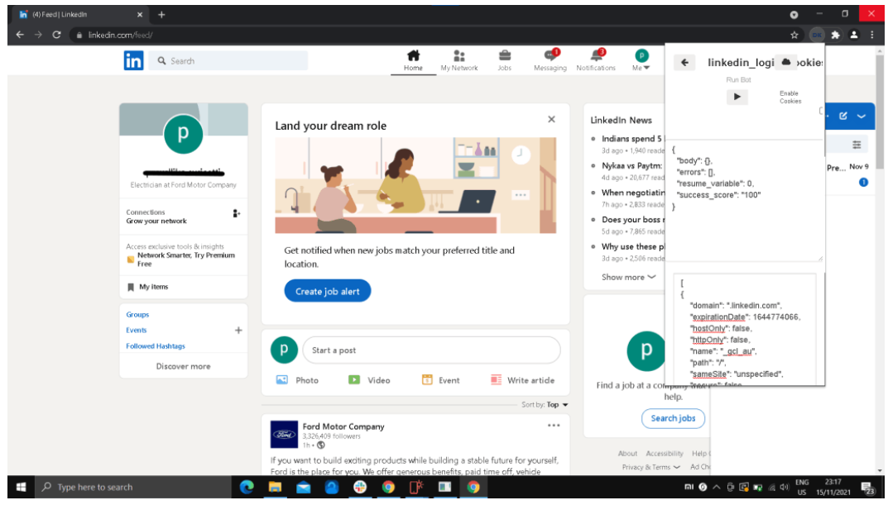

Create a bot that login's twitter with cookies
************

* **Step1:** Create a new bot naming "twitter_login_cookies".

   
* **Step2:** Click on the Datakund extension, to minimise the extension bar.

    * Lets go to https://twitter.com/i/flow/login (linkedin signup page), before training the bot.
   

   
* **Step3:** Since we are using cookies as input to login, before training the bot we need to add variable(cookies) to the input.

   * click on the variable button on the bot's menu.
   
   * At the input column, type cookies and save. Now go back to train the bot.
   

   
* **Step4:** Click on Datakund extension again, and click "train" to start training our new bot (twitter_login_cookies).

* **Step5:** Now refresh the page, to add URL to the event.
   
   * Minimise Datakund extension windows.
   

* **Step6:** Now right click anywhere on the screen, to see datakund in the menu.

   * Click Datakund --> inputs --> variables --> cookies --> set cookies.
   
   * After setting the cookie, again refresh the page. 

   * Now the events should be in order as shown in the Image.
   

* **Step7:** Now to run the bot click "run" button and paste the cookies in the cookie extension (open a fresh chrome browser open linkedin and login, after login in install cookie extension and copy the cookies of logged in linkedin page).
   
   * After pasting the cookies in the the extension bar looks as in the Image 12.
   
   * Now click "Run"
   

* **Step8:** After running the bot, wait for the bot to do the job as shown in Image 13. 

   * It will automatically login with a single press.
   

* **Step8:** As shown in the Image 14, bot will login twitter without entering any credentials.

