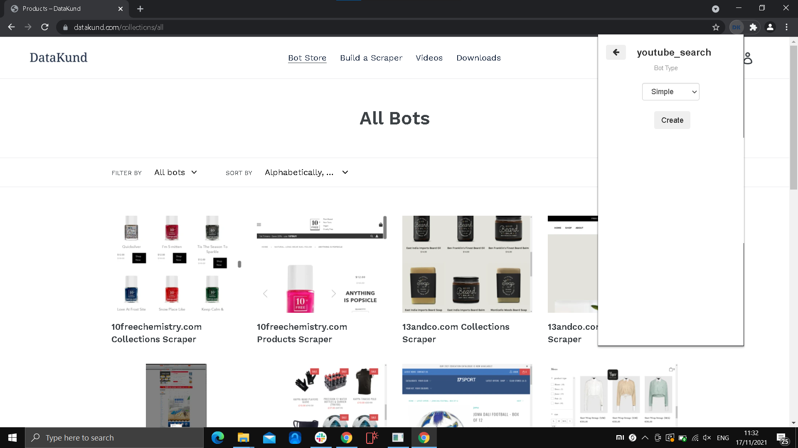
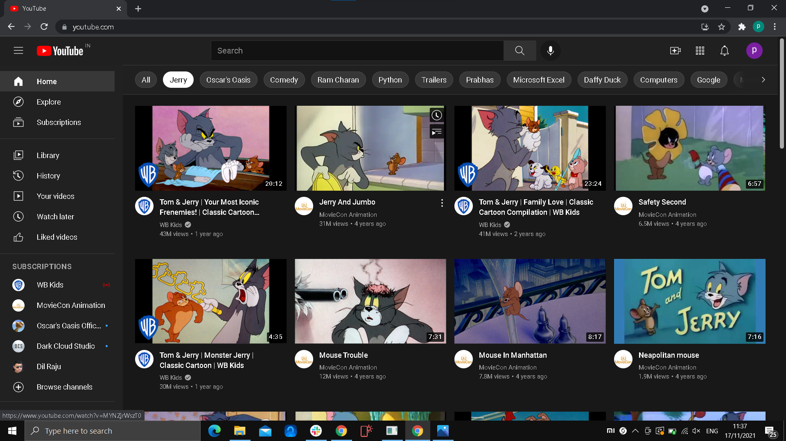
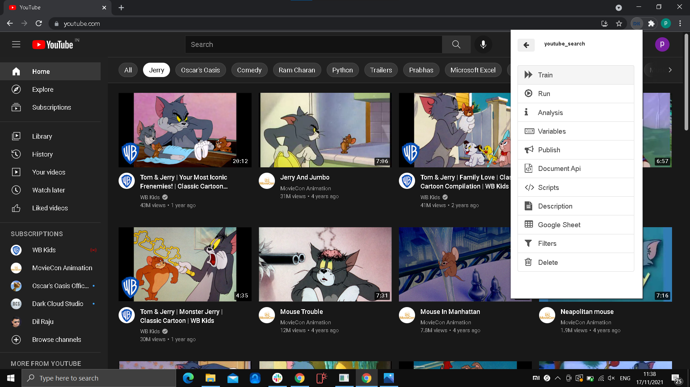
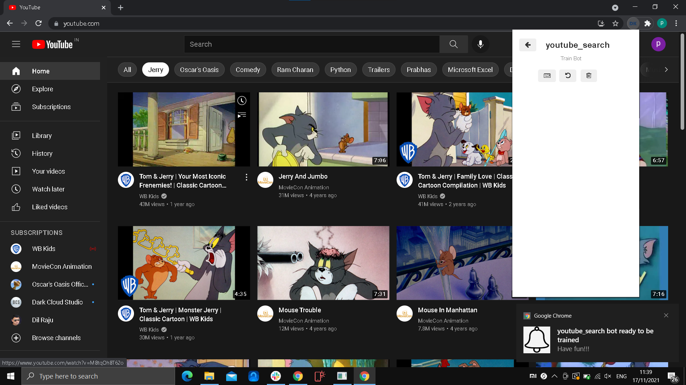
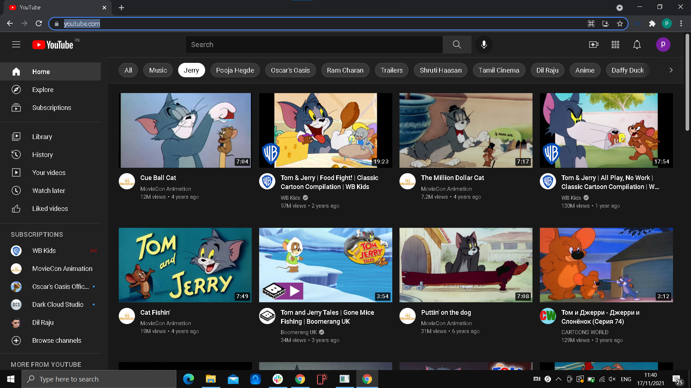
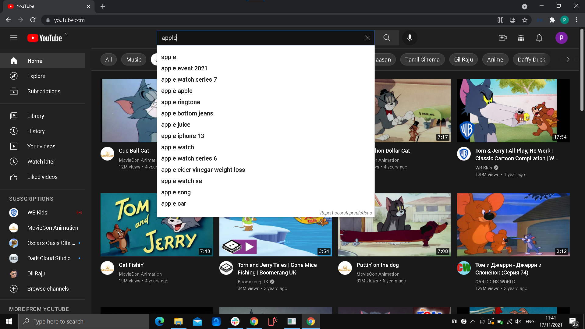
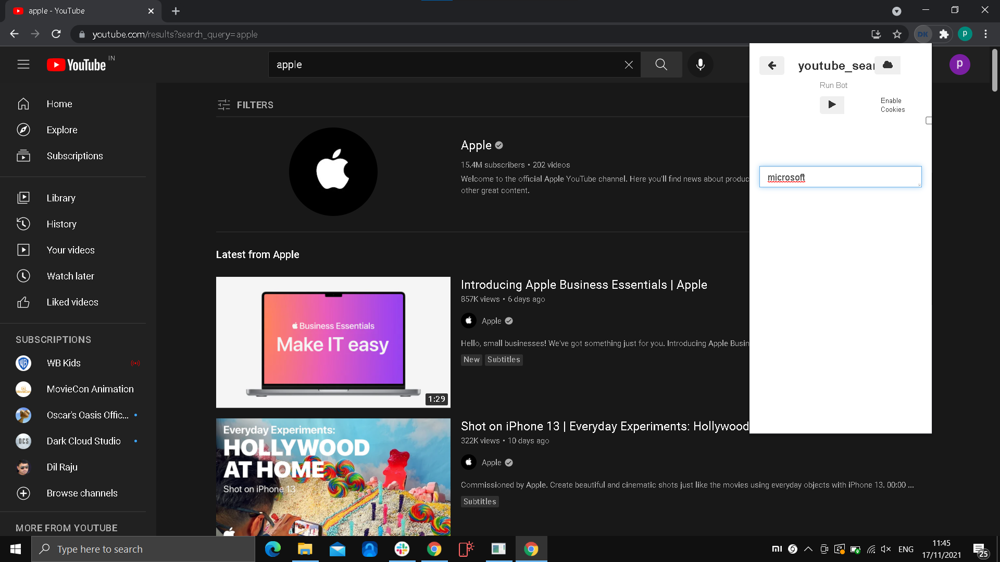

Create a bot that searches for keyword in youtube
************

* **Step1:** Create a new bot naming "youtube_search".

   
* **Step2:** Click on the Datakund extension, to minimise the extension bar.

    * Lets go to https://youtube.com/ before training the bot, and sign in for the bot to search the keyword.
   

   
* **Step3:** Click on Datakund extension again, and click "train" to start training our new bot (youtube_search).
   

   
* **Step4:** As soon as we click "train", bot starts training and mimics your action and adds it to the event. 
   

* **Step5:** Now refresh the page, to add URL(https://youtube.com/) to the event.
 
  * Can also add the URL to event by typing "youtube.com" in search bar in toolbar, and login. 
  
  * Datakund extension window minimises.

* **Step6:** Now entre the keyword (apple) to be searched in youtube search and press entre to search

   * this is for the bot to learn and mimic your actions. 
   

* **Step7:** Now to run the bot, go back to the bot's menu and click "run" in the menu.

  * enter the keyword to be searched (microsoft).
   

* **Step8:** After clicking "run",Now wait for the bot to load.
   

* **Step9:** As shown in the Image below, bot will show the search results of the new keyword.
   

